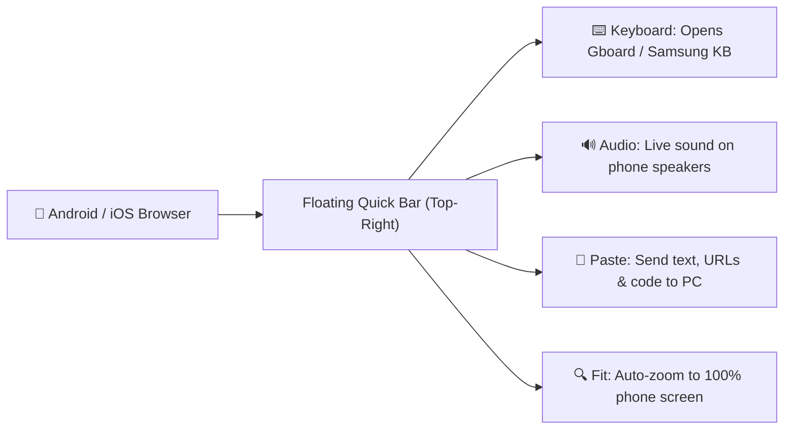

<div align="center">

# 🚀 Ubuntu 24.04 Cloud PC Workstation
### A Full-Featured, Ultra-Low Latency Cloud Linux Desktop Optimized for Mobile Phones & Browsers

[](https://ubuntu.com/)
[](LICENSE)
[](docs/TERMUX_GUIDE.md)
[](docs/ARCHITECTURE.md)
[](https://cloudflare.com)
[]()

<br/>

**Transform any GitHub Codespace, Docker container, or VPS into a complete, daily-driver Ubuntu PC.**  
*Includes Real-Time Web Audio, 1-Tap Mobile Keyboard, Visual Studio Code, Antigravity IDE, Google Chrome, and 24/7 Auto-Healing.*

---

[🚀 Quick Start](#-quick-start) •
[📱 Mobile Setup](#-mobile--android-usage) •
[✨ Features](#-key-features) •
[🏛️ Architecture](#-system-architecture) •
[🛠️ CLI Commands](#-cli-management-tool) •
[📖 Documentation](#-documentation)

---

</div>

## ✨ Key Features

| Feature | Description |
| :--- | :--- |
| **📱 Mobile-First Controls** | Floating quick toolbar with instant Gboard/Samsung keyboard activator and paste modal. |
| **🔊 Live Audio Streaming** | PulseAudio + WebAudio bridge streams YouTube, music, and game audio directly to phone speakers. |
| **💻 Visual Studio Code & IDE** | Official Microsoft VS Code `.deb` desktop app + Antigravity AI IDE pair programmer. |
| **🌐 Google Chrome (Rock Solid)** | Configured with container software rasterizer flags (zero multi-process crashes). |
| **🎮 Android App Player** | BlueStacks Android Game Player launcher integrated into the desktop. |
| **📲 PWA Mobile Installation** | Install the desktop as an app on your Android home screen for full-screen 1-tap access. |
| **🛡️ 24/7 Self-Healing Watchdog** | Background daemon automatically checks and revives all services every 10 seconds. |
| **⚡ 1-Command Universal Setup** | Bootstraps the entire desktop stack in under 2 minutes on Codespaces, Docker, or Termux. |

---

## 🚀 Quick Start

### Option 1: Run in GitHub Codespaces (1-Click)
1. Fork or open this repository in **GitHub Codespaces**.
2. Run the installer:
   ```bash
   ./setup.sh
   ```
3. Copy the printed **Cloudflare Live URL** and open it in your browser!

---

### Option 2: Run from Termux on Android Phone
Open **Termux** and paste this single command:

```bash
pkg update -y && pkg install -y git curl
git clone https://github.com/OG-o/Work.git
cd Work
./setup.sh
```

---

### Option 3: Run on any Ubuntu / Debian VPS
```bash
git clone https://github.com/OG-o/Work.git
cd Work
sudo bash ./setup.sh
```

---

## 📱 Mobile & Android Usage



### 📲 Install as an App on Your Android Home Screen:
1. Open your live Cloudflare URL in **Google Chrome** on your phone.
2. Tap the **3 vertical dots menu (⋮)** in the top-right corner.
3. Tap **"Install App"** (or **"Add to Home screen"**).
4. Tap **Install**.
5. Tap the new **"Cloud PC"** app icon on your home screen to launch in **full-screen immersive mode** (no browser address bars)!

---

## 🏛️ System Architecture

```
┌────────────────────────────────────────────────────────────────────────┐
│                        Ubuntu 24.04 Linux Host                         │
│                                                                        │
│  ┌───────────────────────┐              ┌───────────────────────────┐  │
│  │   TigerVNC Server     │              │    PulseAudio Server      │  │
│  │   1920x1080 (Port 5901│              │   (Virtual Null Sink)     │  │
│  └───────────┬───────────┘              └─────────────┬─────────────┘  │
│              │                                        │                │
│              ▼                                        ▼                │
│  ┌───────────────────────┐              ┌───────────────────────────┐  │
│  │  Websockify WS Proxy  │              │   audio_streamer.py       │  │
│  │      (Port 6081)      │              │  Live MP3 (Port 5711)     │  │
│  └───────────┬───────────┘              └─────────────┬─────────────┘  │
│              │                                        │                │
│              └───────────────────┬────────────────────┘                │
│                                  ▼                                     │
│                     ┌─────────────────────────┐                        │
│                     │  Nginx Unified Gateway  │                        │
│                     │       (Port 6080)       │                        │
│                     └────────────┬────────────┘                        │
└──────────────────────────────────┼─────────────────────────────────────┘
                                   ▼
                      ┌─────────────────────────┐
                      │    Cloudflare Tunnel    │
                      └────────────┬────────────┘
                                   ▼
               📱 Mobile / Browser Client (60 FPS Video + Audio)
```

For full technical specifications, see [docs/ARCHITECTURE.md](docs/ARCHITECTURE.md).

---

## 🛠️ CLI Management Tool

Manage your cloud desktop anytime with the included `cloudpc` CLI:

```bash
# Start all desktop, audio, and tunnel services
cloudpc start

# Check real-time health status of all ports
cloudpc status

# Print the active public web access link
cloudpc url

# Restart all services
cloudpc restart

# Stop all services
cloudpc stop

# View recent system and tunnel logs
cloudpc logs
```

---

## 📦 Installed Applications Suite

- 💻 **Visual Studio Code**: Official Microsoft `.deb` native desktop app with extensions support.
- 🚀 **Antigravity IDE**: Google AI-First IDE with integrated `agy` CLI pair programmer.
- 🌐 **Google Chrome**: Web browser stabilized for unprivileged container environments.
- 🎮 **BlueStacks Android Player**: Cloud Android app & game player with `adb`/`fastboot` tools.
- 📟 **Ubuntu Terminal**: Full bash shell with `sudo` root privileges.
- 📂 **Thunar File Manager**: Desktop file manager with zip/tar archive handling.
- 📄 **Evince & Ristretto**: PDF reader and high-resolution photo viewer.
- ⌨️ **Matchbox Virtual Keyboard**: On-screen touch keyboard docked on the screen.

---

## 📖 Documentation

- 📱 **[Android & Termux Beginner Guide](docs/TERMUX_GUIDE.md)**: Detailed mobile walkthrough.
- 🏛️ **[Architecture & Design](docs/ARCHITECTURE.md)**: Deep technical system pipeline.
- 🛠️ **[Troubleshooting FAQ](docs/TROUBLESHOOTING.md)**: Solutions for common issues.
- 🤝 **[Contributing Guidelines](CONTRIBUTING.md)**: How to contribute.

---

## 📄 License

This project is licensed under the **MIT License** - see the [LICENSE](LICENSE) file for details.