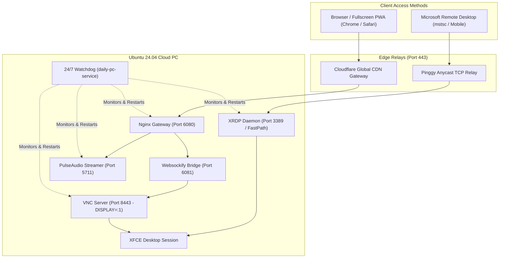

<div align="center">

# 🚀 Ubuntu 24.04 Cloud PC Workstation
### A Full-Featured, Ultra-Low Latency Cloud Linux Desktop Optimized for Mobile, Native RDP & Browsers

[](https://ubuntu.com/)
[](LICENSE)
[](docs/RDP_PINGGY_GUIDE.md)
[](docs/TERMUX_GUIDE.md)
[](docs/ARCHITECTURE.md)
[](https://cloudflare.com)
[]()

<br/>

**Transform any GitHub Codespace, Docker container, or VPS into a complete, daily-driver Ubuntu PC.**  
*Includes Native Microsoft Remote Desktop (MSTSC) support, Real-Time Web Audio, 1-Tap Mobile Controls, Claude Code, Cursor AI, VS Code, and 24/7 Auto-Healing.*

---

[🚀 Quick Start](#-quick-start) •
[🖥️ Remote Desktop (RDP)](#-microsoft-remote-desktop-mstsc-via-pinggy) •
[📱 Mobile Setup](#-mobile--android-usage) •
[✨ Features](#-key-features) •
[🏛️ Architecture](#-system-architecture) •
[🛠️ CLI Commands](#-cli-management-tool)

---

</div>

## ✨ Key Features

| Feature | Description |
| :--- | :--- |
| **🖥️ Native Microsoft RDP (MSTSC)** | Full support for Microsoft Remote Desktop app via high-performance Pinggy TCP port 443 tunneling. |
| **📱 Mobile-First Controls** | Floating quick toolbar with instant Gboard/Samsung keyboard activator and paste modal. |
| **🔊 Live Audio Streaming** | PulseAudio + WebAudio bridge streams YouTube, music, and game audio directly to phone speakers. |
| **🤖 Claude Code CLI & Desktop** | Official Anthropic Claude Code agentic coding assistant (`claude`) pre-installed. |
| **👥 Facebook Real Desktop App** | Official compiled native desktop application (`Caprine v2.61.0`) with notifications and system tray. |
| **💻 Visual Studio Code & Cursor AI** | Pre-installed IDE suite with full code editing, git integration, and extensions. |
| **🌐 Google Chrome (Rock Solid)** | Configured with container software rasterizer flags (zero multi-process crashes). |
| **📲 PWA Mobile Installation** | Install the desktop as an app on your Android/iOS home screen for full-screen 1-tap access. |

---

## 🖥️ Microsoft Remote Desktop (MSTSC) via Pinggy

You can connect directly using the **official Microsoft Remote Desktop App** (`mstsc` on Windows or the mobile RD Client app) over an encrypted Port 443 TCP tunnel:

### 1. Launch RDP Tunnel
```bash
cloudpc rdp
```

### 2. Enter Credentials in Remote Desktop App
- **PC Name / Host**: `your-allocated-address.run.pinggy-free.link:port` *(from `cloudpc rdp`)*
- **Username**: `codespace`
- **Password**: `codespace`
- **Session**: Automatic Xorg / XFCE (FastPath 60 FPS, 4MB Buffers)

📖 *Read the full technical deep dive in [RDP & Pinggy Architecture Guide](docs/RDP_PINGGY_GUIDE.md).*

---

## 🚀 Quick Start (Browser / Fullscreen PWA)

1. Check your live access link:
   ```bash
   cloudpc status
   ```
2. Open the URL in **Google Chrome** on your phone or PC.
3. Tap **`⋮` (3 dots)** in Chrome ➔ **"Install App"** to run as a **fullscreen native desktop app**.

---

## 🛠️ CLI Management Tool (`cloudpc`)

The `cloudpc` CLI utility allows you to control the entire environment:

```bash
cloudpc start     # Launch all Cloud PC services & 24/7 watchdog
cloudpc stop      # Stop all desktop, audio, and network services
cloudpc restart   # Restart the entire Cloud PC stack
cloudpc status    # Check status of VNC, Audio, Nginx, XRDP, and Tunnel
cloudpc url       # Print the active public web access link
cloudpc rdp       # Generate live Microsoft Remote Desktop tunnel
cloudpc health    # Run comprehensive diagnostic test suite
cloudpc logs      # Show real-time system and watchdog logs
```

---

## 🏛️ System Architecture



---

## 📄 License
This project is licensed under the [MIT License](LICENSE).