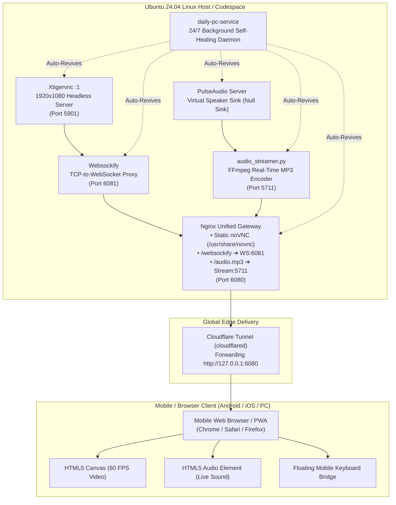

# 🏛️ Ubuntu Cloud PC Architecture & Technical Design

This document details the inner workings and system architecture of the **Ubuntu Cloud PC Workstation**.

---

## 📐 System Pipeline Overview

---

## 1. 🖥️ Headless Display & Window Management
- **Display Engine**: `Xtigervnc :1 -geometry 1920x1080 -depth 24 -SecurityTypes None -rfbport 5901`
- **Session Manager**: `dbus-run-session startxfce4`
- **Window Management**: `xfwm4` with compositing, wallpaper engine (`xfdesktop`), panel dock (`xfce4-panel`), and modern `Papirus` icon theme.
- **Rootless Headless Permissions**: Direct `/tmp/.X11-unix` and `/tmp/.ICE-unix` permissions configuration allows running inside unprivileged Docker containers.

---

## 2. 🔊 Real-Time Mobile Audio Subsystem
- **Sound Daemon**: `pulseaudio --start --exit-idle-time=-1`
- **Virtual Speaker Sink**: `module-null-sink sink_name=virtual_speaker sink_properties=device.description=Virtual_Speaker`
- **Audio Capture & Streaming**: `scripts/audio_streamer.py` uses `ffmpeg` to capture raw PCM from `virtual_speaker.monitor`, encode it on-the-fly to a 128kbps low-latency MP3 stream, and serve it via chunked HTTP on port `5711`.
- **Autoplay Handling**: The mobile quick toolbar provides an explicit user-gesture `[ 🔊 Audio ]` toggle button that complies with modern mobile browser autoplay policies.

---

## 3. 🌐 Nginx Unified Gateway Architecture
Rather than exposing multiple fragile ports, Nginx acts as a single multiplexed entry point on port `6080`:
- **Static Assets (`/`)**: Serves the noVNC HTML5 client from `/usr/share/novnc`.
- **Video Stream (`/websockify`)**: Upgrades HTTP connections to WebSockets and proxies them to `127.0.0.1:6081` (connecting directly to TigerVNC).
- **Audio Stream (`/audio.mp3`)**: Proxies live chunked audio from `127.0.0.1:5711/audio.mp3` with HTTP buffering disabled (`proxy_buffering off`).

---

## 4. 📱 Mobile Touch & Virtual Keyboard Bridge
- **The Problem**: Mobile browsers only summon on-screen keyboards (Gboard/Samsung Keyboard) when an HTML `<input>` or `<textarea>` element is focused. HTML5 `<canvas>` elements do not trigger the virtual keyboard.
- **The Solution**: `config/mobile-helper.js` injects a floating pill toolbar with:
  1. An invisible input bridge that instantly summons the native phone keyboard.
  2. A quick modal for typing or pasting long URLs, code blocks, or passwords.
  3. Responsive auto-scaling toggle (`scaleViewport`) ensuring the 1080p desktop fits any smartphone screen.

---

## 5. 🛡️ 24/7 Self-Healing Watchdog Daemon
- `scripts/daily-pc-service` runs continuously in the background.
- Every 10 seconds, it audits:
  - TigerVNC (`Xtigervnc :1`)
  - PulseAudio & Audio Streamer
  - Websockify VNC Proxy
  - Nginx Gateway
  - Cloudflare Tunnel
- If any service is killed or crashes, the watchdog automatically revives it within seconds without requiring manual intervention.
