# 🖥️ Microsoft Remote Desktop (MSTSC) & Pinggy Tunnel Architecture

This guide explains the inner workings, network routing, and low-latency performance tuning for using the native **Microsoft Remote Desktop App (`mstsc` / RD Client)** with the Ubuntu Cloud PC.

---

## 🏛️ System Architecture

```mermaid
graph LR
    subgraph ClientLayer["Your Client Device"]
        MSTSC["Microsoft Remote Desktop App (mstsc / Android / iOS)"]
    end

    subgraph TunnelLayer["Pinggy Anycast Network (Port 443)"]
        PinggyEdge["Pinggy TCP Edge Server (*.run.pinggy-free.link:port)"]
    end

    subgraph CloudPCLayer["Ubuntu Cloud PC (Container / VPS)"]
        SSHClient["Outbound SSH Tunnel (-p 443 -R0:localhost:3389)"]
        XRDP["XRDP Daemon (Port 3389 / FastPath / 4MB Buffers)"]
        Sesman["xrdp-sesman (Container PAM Auth)"]
        Xorg["Xorg Display Server (:10)"]
        XFCE["XFCE Desktop Environment"]
    end

    MSTSC -->|"RDP Protocol (TLS 1.3)"| PinggyEdge
    PinggyEdge --> SSHClient
    SSHClient --> XRDP
    XRDP -->|"autorun=Xorg"| Sesman
    Sesman --> Xorg --> XFCE
```



---

## 🔍 How It Works: Technical Deep Dive

### 1. Bypassing Container Egress Firewalls via Port 443
In enterprise cloud containers (e.g., GitHub Codespaces), direct inbound raw TCP connections and arbitrary outbound ports are strictly blocked. 
However, **outbound Port 443 (HTTPS / TLS)** is completely unrestricted. 

The Pinggy tunnel client establishes an outbound SSH connection over **Port 443** to `tcp@a.pinggy.io` and requests a remote reverse forward (`-R0:localhost:3389`). Pinggy’s edge servers assign a dedicated public hostname and port, allowing Microsoft Remote Desktop to route RDP packets directly into the container's XRDP daemon.

### 2. High-Performance XRDP Tuning
- **4MB TCP Socket Buffers**: `tcp_send_buffer_bytes=4194304` and `tcp_recv_buffer_bytes=4194304` eliminate network pipeline stalls.
- **FastPath Acceleration**: `use_fastpath=both` and `tcp_nodelay=true` bypass Nagle's algorithm for instant key/mouse responsiveness.
- **24-Bit RGB Optimization**: `max_bpp=24` cuts network bandwidth by 25% compared to 32bpp without loss in clarity.
- **Compositor Overhead Reduction**: XFCE drop shadows and alpha blending are disabled to guarantee 60 FPS rendering.

### 3. Container PAM Authentication & Auto-Login
- **PAM Stack**: Configured with headless-compatible `pam_unix.so` / `pam_permit.so` in `/etc/pam.d/xrdp-sesman`, bypassing `systemd-logind`.
- **Auto-Login**: Configured with `autorun=Xorg` in `/etc/xrdp/xrdp.ini` so credentials (`codespace:codespace`) immediately attach to the active XFCE session.

---

## 🚀 How to Connect

### 1. Generate Your RDP Address
Run the following command in terminal:
```bash
cloudpc rdp
```

### 2. Connect in Microsoft Remote Desktop
1. Open **Microsoft Remote Desktop** app on Windows, Android, iOS, or Mac.
2. Tap **Add PC** (`+`).
3. In **PC Name / Computer**, enter the generated Pinggy address (e.g., `xyz.run.pinggy-free.link:12345`).
4. Enter credentials:
   - **Username**: `codespace`
   - **Password**: `codespace`
5. Tap **Connect**!
